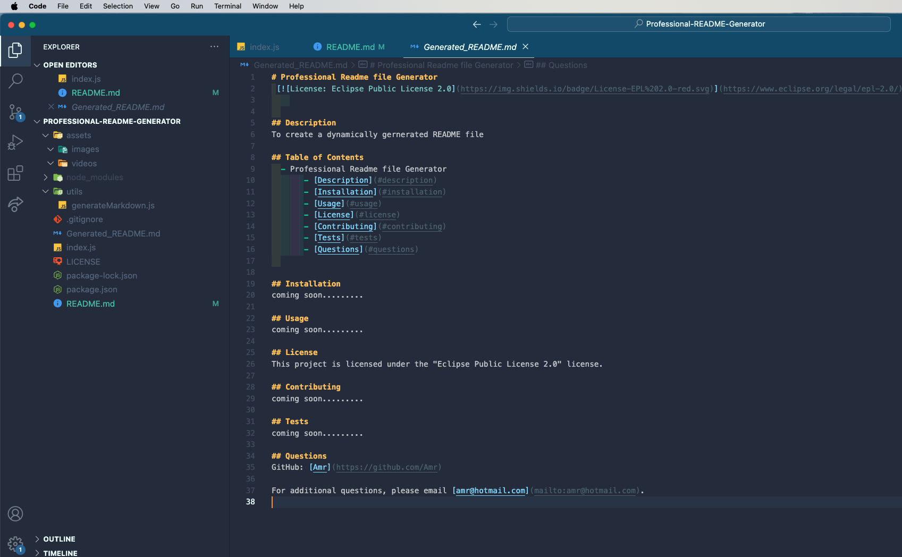

# Professional-README-Generator

The Challenge is to build a a command-line application that dynamically generates a professional README.md file from a user's input.

## Skills used / learned :
- Exposure to Node.js and the concepts of modules and npm.  
- Initialising a Node.js project.  
- Installing third-party dependencies.  
- Creating interactive command-line applications.  
- Used 'fs' library to read and write files.  

## Technologies/Languages
- JavaScript.  
- Node.js.  
- Inquirer.  
- npm.  

## Credit
 I have aquired valuable skills during the work on this challenge and also credit to the following:  
 - Google rearch on functions
 - Classes recordings and exercises with team members 
 - Markdown License badges ( https://gist.github.com/lukas-h/2a5d00690736b4c3a7ba)  

## Resources
- W3School • ChatGPT • Google search engines • Classes recordings, activities and notes  

## Installation
- Pre-requiste:
    - Access to VSC editor
    - Download the code toyour VSC editor
    - Navigate to 'index.js' file
    - type in the terminal the foloowing command ' node index.js'

## Usage
- This commandline app designed to capture users input and generate a README FILE. It can be used in any project that would benefit from fast automated processes.   
- Navigate to the desired directory.  
- Type in ' node index.js'.  
- Respond to the on-screen questions.  
- Verify that your answers were all registered in a new ' Generated_README.md' file.  

## images
   

## Video
   

 

